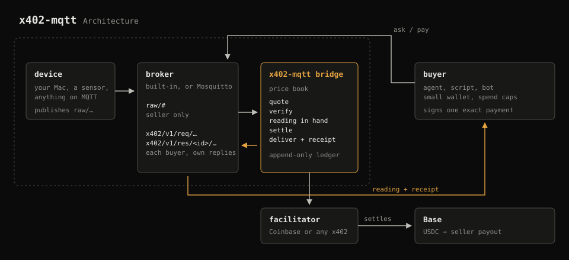

# x402-mqtt

x402 payments over MQTT. Your devices sell their data to agents, paid in USDC on Base.

The first x402 transport for MQTT, the protocol most connected devices already speak. 



The first real use case is a [MacBook selling](EVIDENCE.md) its own sensor readings on Base mainnet.

## Sell your Mac's readings

```bash
export CDP_API_KEY_ID=…  CDP_API_KEY_SECRET=…
npx @cultos/x402-mqtt sell --mac --payout 0xYourAddress
```

```
selling on mqtt://127.0.0.1:1883 payout 0xYourAddress Base
  mac/battery/temperature      $0.001
  mac/battery/level            $0.001
  mac/power/watts              $0.001
  …
sales page  http://127.0.0.1:4020
```

The built-in broker starts automatically, so there's nothing else to install. Money goes straight to your payout address; the seller side never holds a key.

## Buy a reading

```bash
X402_MQTT_BUYER_KEY=0x… npx @cultos/x402-mqtt buy mac/battery/temperature
paid $0.001 · 31.4 °C · tx 0xec7f730c…
```

Or from an agent:

```ts
import { createBuyer } from "@cultos/x402-mqtt";

const buyer = await createBuyer({ url: "mqtt://127.0.0.1:1883", privateKey, maxPerCall: "0.01", maxTotal: "1" });
const { reading, settlement } = await buyer.buy("mac/battery/temperature");
```

## How it works

1. The buyer asks on `x402/v1/req/<topic>` and gets a standard x402 `402` quote.
2. It signs one exact USDC authorization and asks again with it.
3. The bridge verifies the payment, makes sure it has a fresh reading, settles, and only then replies with the reading and the transaction.

If the device is offline, the payment is invalid or settlement fails, nobody is charged. The full protocol is in [SPEC.md](SPEC.md). It follows the x402 transport template and reuses x402's own `PaymentRequired`, `PaymentPayload` and `SettleResponse`.

## Sell any device

Anything that publishes to MQTT can sell. Point the device at `raw/<topic>` and list the topic:

```json
{
  "payout": "0xYourAddress",
  "offers": [{ "topic": "garden/soil/moisture", "price": "0.002", "unit": "%" }]
}
```

Save it as `x402-mqtt.json` and run `x402-mqtt sell`. Readings older than 30 seconds count as offline and are never sold.

## Works with Mosquitto

Already running a broker? Set `"broker"` to it with the bridge's username and password (`mqtts://` or `wss://` unless it runs on the same machine), and use the access rules in [examples/mosquitto](examples/mosquitto): buyers can only ask and read their own replies, and only the bridge can read `raw/#`. The evidence was collected on Mosquitto 2.1.2.

## Safety Notes

- **Sellers hold no keys,** only a payout address. The facilitator key lives in the bridge and is never logged.
- **Charged only for delivered data.** Settlement happens after the reading is in hand and before it's sent. Uncertain settlements are checked onchain, and count only if the exact USDC transfer to your payout is there.
- **Idempotent payments.** Replays, duplicates and concurrent reuse of one payment are refused. MQTT redelivery never double-charges.
- **Private data stays private.** Raw readings and other buyers' replies are blocked at the broker, and the built-in broker only accepts requests that reply to the sender itself.
- **Floods stay cheap.** Forged and unfunded payments are refused before they reach the facilitator, and paid requests are limited per paying wallet, so a flood can't lock out buyers who already paid.
- **Buyers have caps,** per call and in total, held even when buys run in parallel. A payment counts as spent until it expires unused on-chain, whatever the seller replies, and the same payment is resent instead of signing a new one.
- **TLS for remote brokers.** The buyer refuses plain `mqtt://` or `ws://` to anything but localhost unless you pass `--allow-cleartext`.
- **USDC only.** The buyer signs only for USDC, so its caps always mean dollars, and it rejects malformed readings.

## datasets

[dataset/](dataset): initial runs as JSONL and CSV, with checksums.

## From source

```bash
git clone https://github.com/thesmithdao/x402-mqtt && cd x402-mqtt
npm install && npm run build
node dist/cli.js sell --mac --payout 0xYourAddress
```

Node 20 or newer. MIT license. Built by [Cult OS](https://cultos.dev).
